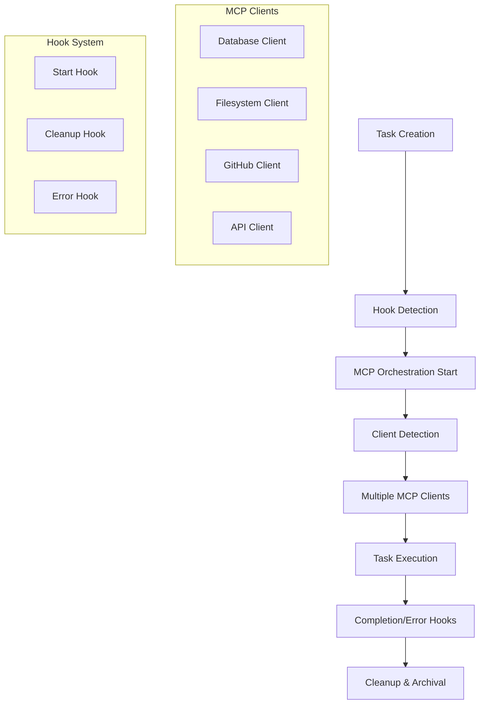

# Multi-MCP Client Task System Architecture

## Overview

The Multi-MCP Client Task System provides a robust framework for orchestrating multiple Model Context Protocol (MCP) connections within the Magic Vibe task management system. This architecture enables AI agents to manage complex workflows that require integration with multiple external systems, databases, APIs, and services.

## System Architecture

### Core Components



### Directory Structure

```
.magic-vibe/
├── rules/hooks/
│   ├── mcp-orchestration-start.hook.md      # Initialization hook
│   ├── mcp-orchestration-cleanup.hook.md    # Completion hook
│   └── mcp-error-handling.hook.md           # Error handling hook
├── ai/
│   ├── tasks/
│   │   └── task_{id}_{name}.md               # Task definitions
│   ├── mcp-clients/
│   │   ├── init-clients.py                  # Client initialization
│   │   ├── cleanup-clients.py               # Client cleanup
│   │   ├── diagnose-errors.py               # Error diagnosis
│   │   ├── orchestration.log                # Global orchestration log
│   │   └── {task_id}/                       # Task-specific data
│   │       ├── mcp-config.json              # Task MCP configuration
│   │       ├── execution-metrics.json       # Performance metrics
│   │       └── diagnostic-report.json       # Error diagnostics
│   └── memory/
│       ├── mcp-executions/                  # Successful executions
│       └── mcp-failures/                    # Failed executions
```

## Hook System Integration

### 1. Orchestration Start Hook

**Trigger**: `task_status_change` → `inprogress`  
**Priority**: 5  
**Purpose**: Initialize MCP client connections when a task starts

**Key Features**:

- Creates task-specific MCP directory structure
- Initializes configuration files with task metadata
- Executes Python client detection and connection logic
- Logs orchestration start events

### 2. Orchestration Cleanup Hook

**Trigger**: `task_status_change` → `completed`  
**Priority**: 15  
**Purpose**: Clean up MCP resources and collect execution data

**Key Features**:

- Gracefully disconnects all MCP clients
- Collects performance metrics and execution logs
- Archives task data to memory directory
- Generates completion summaries and reports

### 3. Error Handling Hook

**Trigger**: `task_status_change` → `failed`  
**Priority**: 20  
**Purpose**: Handle MCP errors and provide diagnostic information

**Key Features**:

- Performs emergency cleanup of failed connections
- Generates comprehensive error diagnostics
- Archives failure data for analysis
- Provides recovery recommendations

## MCP Client Management

### Automatic Client Detection

The system automatically detects required MCP clients based on task content analysis:

| Keywords | Required Client | Purpose |
|----------|----------------|---------|
| database, sql, query, migration | Database Client | Database operations |
| file, directory, upload, storage | Filesystem Client | File system access |
| github, repository, commit, branch | GitHub Client | Repository integration |
| api, rest, endpoint, service | API Client | External API access |

### Client Configuration

Each MCP client is configured with:

```json
{
  "name": "database",
  "type": "database",
  "command": "python",
  "args": ["mcp-database-server.py"],
  "env": {
    "DB_CONNECTION_STRING": "${DB_URL}",
    "DB_READ_ONLY": "true",
    "DB_TIMEOUT": "30"
  }
}
```

### Connection Management

- **Concurrent Connections**: All clients connect simultaneously
- **Health Monitoring**: Regular health checks on active connections
- **Graceful Degradation**: System continues with available clients
- **Resource Cleanup**: Automatic cleanup on task completion/failure

## Task Configuration

### Task YAML Frontmatter

```yaml
---
id: 1
title: 'Setup Multi-MCP Data Processing Pipeline'
status: pending
priority: high
feature: 'Data Integration System'
commit_type: feat
dependencies: []
assigned_agent: null
created_at: "2025-01-15T10:30:00Z"
started_at: null
completed_at: null
error_log: null
---
```

### Task Description Requirements

For automatic MCP client detection, include relevant keywords in:

- **Title**: Main task objective
- **Feature**: Feature area or system component
- **Description**: Detailed requirements and implementation notes

## Execution Workflow

### 1. Task Creation

- AI agent creates task file with MCP requirements
- Task includes feature keywords for client detection
- YAML frontmatter configured with appropriate metadata

### 2. Task Start (Status: `inprogress`)

- **Orchestration Start Hook** triggers automatically
- Creates task-specific MCP directory structure
- Initializes configuration files
- Executes client detection algorithm
- Establishes connections to required MCP servers
- Logs successful connections and any failures

### 3. Task Execution

- AI agent performs task using connected MCP clients
- System monitors client health and performance
- Execution metrics collected throughout process
- Errors handled gracefully with fallback mechanisms

### 4. Task Completion (Status: `completed`)

- **Orchestration Cleanup Hook** triggers automatically
- Disconnects all MCP clients gracefully
- Collects final execution metrics
- Archives task data to memory directory
- Generates completion summary

### 5. Error Handling (Status: `failed`)

- **Error Handling Hook** triggers automatically
- Performs emergency cleanup of connections
- Generates comprehensive diagnostic report
- Archives failure data for analysis
- Provides recovery recommendations

## Configuration Files

### MCP Configuration (`mcp-config.json`)

```json
{
  "taskId": "1",
  "taskTitle": "Setup Multi-MCP Data Processing Pipeline",
  "feature": "Data Integration System",
  "mcpClients": {
    "database": {
      "config": { /* client configuration */ },
      "connected_at": "2025-01-15T10:35:00Z",
      "status": "connected"
    }
  },
  "activeConnections": ["database", "filesystem", "api"],
  "executionLog": [],
  "startedAt": "2025-01-15T10:30:00Z"
}
```

### Execution Metrics (`execution-metrics.json`)

```json
{
  "taskId": "1",
  "finalStatus": "completed",
  "totalClients": 3,
  "successfulConnections": 3,
  "failedConnections": 0,
  "clientConnections": {
    "database": {
      "status": "connected",
      "duration_seconds": 245.7
    }
  }
}
```

## Error Handling and Recovery

### Error Categories

1. **Connection Errors**: Server unavailable, network issues
2. **Permission Errors**: Authentication failures, access denied
3. **Resource Errors**: Missing endpoints, unavailable tools
4. **Format Errors**: Invalid configurations, protocol issues
5. **Resource Exhaustion**: Memory limits, connection limits

### Diagnostic Information

For each error, the system provides:

- **Error Categorization**: Automatic classification of error type
- **Root Cause Analysis**: Likely causes and contributing factors
- **Affected Clients**: Which MCP connections are impacted
- **Recovery Actions**: Step-by-step recovery procedures
- **System Diagnostics**: Environment and configuration analysis

### Recovery Strategies

- **Automatic Retry**: Exponential backoff for transient errors
- **Graceful Degradation**: Continue with available clients
- **Fallback Mechanisms**: Alternative data sources or methods
- **Manual Intervention**: Clear guidance for complex issues

## Best Practices

### Task Design

1. **Clear Requirements**: Specify MCP integration needs explicitly
2. **Appropriate Keywords**: Use standard terminology for auto-detection
3. **Dependency Management**: Consider MCP setup as task dependencies
4. **Error Planning**: Anticipate and plan for connection failures

### Performance Optimization

1. **Connection Pooling**: Reuse connections when possible
2. **Parallel Initialization**: Connect to multiple servers simultaneously
3. **Resource Monitoring**: Track and limit resource usage
4. **Cleanup Procedures**: Ensure proper resource cleanup

### Security Considerations

1. **Credential Management**: Use environment variables for secrets
2. **Access Control**: Implement least-privilege access principles
3. **Audit Logging**: Log all security-relevant events
4. **Network Security**: Use encrypted connections where possible

## Monitoring and Observability

### Logging Levels

- **INFO**: Normal operations, successful connections
- **WARNING**: Recoverable issues, degraded performance
- **ERROR**: Connection failures, task failures
- **DEBUG**: Detailed diagnostic information

### Metrics Collection

- **Connection Success Rate**: Percentage of successful connections
- **Average Connection Time**: Time to establish connections
- **Task Completion Rate**: Success rate for MCP-enabled tasks
- **Error Distribution**: Frequency of different error types

### Alerting

- **Connection Failures**: Alert on repeated connection failures
- **Performance Degradation**: Alert on slow response times
- **Resource Exhaustion**: Alert on resource limit approaches
- **Security Events**: Alert on authentication failures

This architecture provides a robust, scalable foundation for managing complex multi-MCP workflows within the Magic Vibe task system, ensuring reliable execution and comprehensive error handling.
