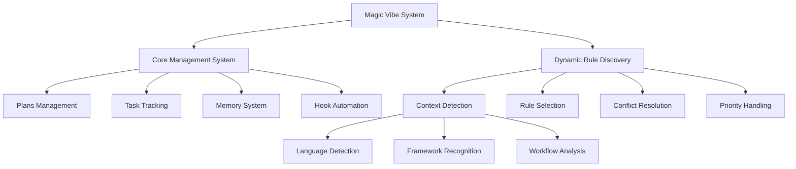
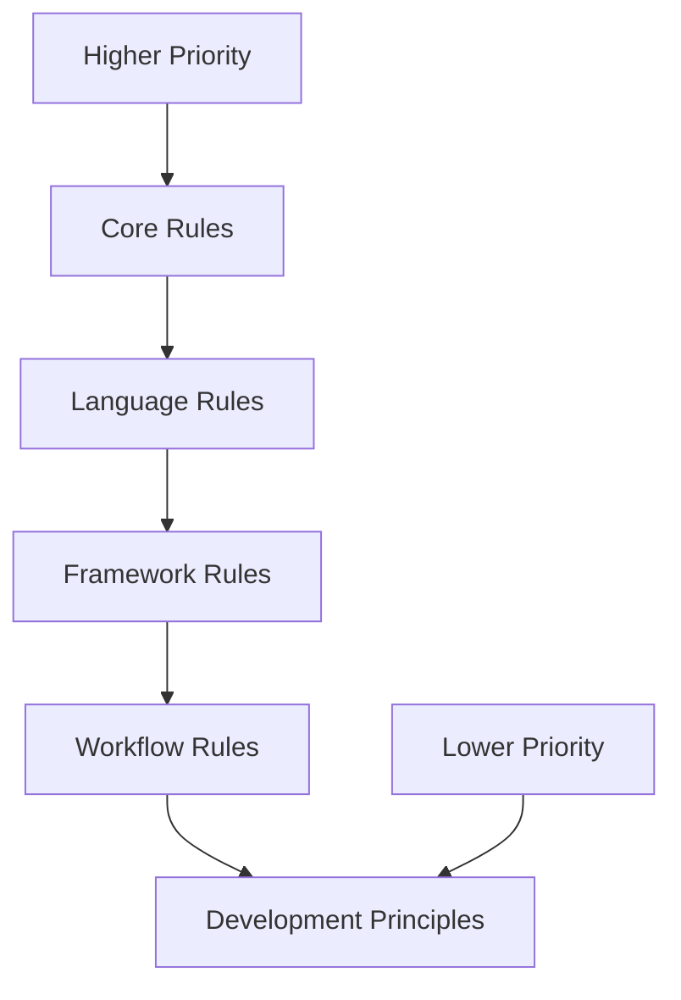
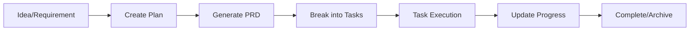
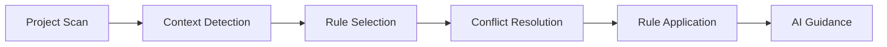
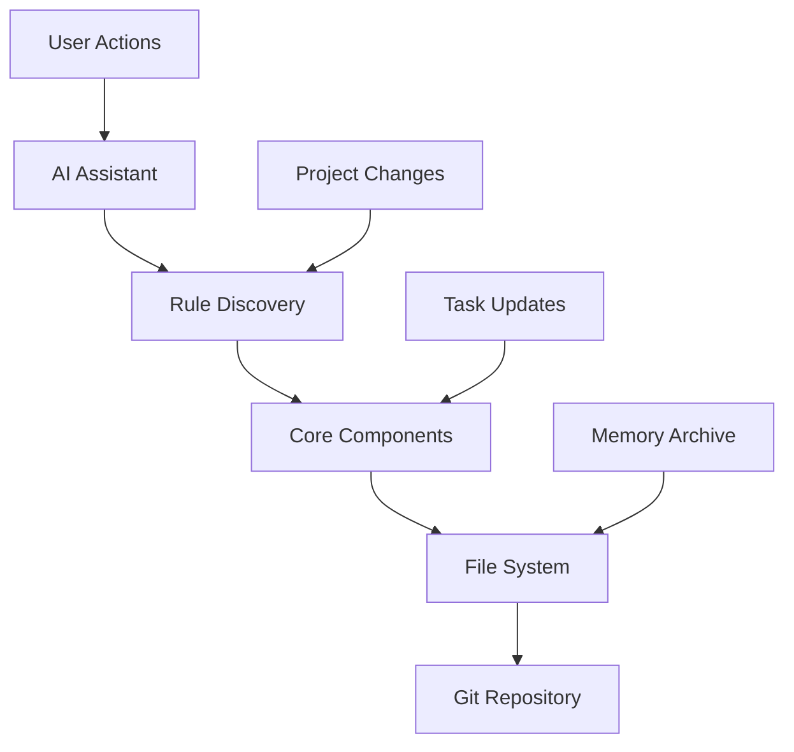

# System Architecture

Understanding the Magic Vibe architecture will help you make the most of the system's capabilities.

## Overview

Magic Vibe uses a **dual-architecture approach** combining file-based project management with intelligent rule discovery:



## Core Management System

### File-Based Architecture

Magic Vibe operates entirely through markdown files, making it:

- **Version Control Friendly**: All data is stored in git-trackable files
- **Human Readable**: No binary databases or complex configurations
- **AI Optimized**: Structured format perfect for AI understanding
- **Cross-Platform**: Works on any system with file access

### Directory Structure

```text
.magic-vibe/
├── ai/                         # Active workspace
│   ├── plans/                  # Current project plans (PRDs)
│   ├── tasks/                  # Active task files
│   ├── hooks/                  # Project-specific automation
│   ├── memory/                 # Archived knowledge base
│   ├── PLANS.md               # Plan index and status
│   └── TASKS.md               # Task index and tracking
├── rules/                      # Rule discovery system
├── doc/                       # Documentation
└── version-manager.sh         # Version management tool
```

## Dynamic Rule Discovery System

### Context Detection Engine

Magic Vibe automatically analyzes your project to determine:

1. **Programming Languages**
   - File extension scanning (`.py`, `.ts`, `.cpp`, etc.)
   - Configuration file detection (`package.json`, `requirements.txt`)
   - Build tool identification (`Makefile`, `CMakeLists.txt`)

2. **Frameworks and Libraries**
   - Dependency analysis (`package.json`, `Cargo.toml`)
   - Import statement scanning
   - Configuration file patterns (`next.config.js`, `svelte.config.js`)

3. **Development Workflows**
   - Git configuration analysis
   - CI/CD pipeline detection (`.github/workflows/`)
   - Quality tool presence (`eslint`, `pytest`, `clippy`)

### Rule Hierarchy

Rules are applied in a specific priority order to prevent conflicts:



1. **Core Rules** (`@core/`) - Always applied, essential Magic Vibe functionality
2. **Language Rules** (`@languages/`) - Programming language-specific standards
3. **Framework Rules** (`@frameworks/`) - Framework-specific patterns and practices
4. **Workflow Rules** (`@workflows/`) - Development process standards
5. **Development Principles** (`@principles/`) - Universal coding principles (OOP, SOLID, etc.)

### Conflict Resolution

When rules potentially conflict, Magic Vibe uses:

- **Specificity Wins**: More specific rules override general ones
- **Composition over Replacement**: Rules complement rather than replace
- **Explicit Override**: Users can manually specify rule precedence
- **Documentation**: All conflicts are logged and explained

## Data Flow

### Plan to Task Flow



### Rule Application Flow



## Memory and Knowledge Management

### Knowledge Persistence

- **Active Knowledge**: Current plans and tasks in `/ai/`
- **Historical Knowledge**: Completed items in `/ai/memory/`
- **System Knowledge**: Rules and configurations in `/rules/`
- **Documentation**: Guides and references in `/doc/`

### Context Continuity

Magic Vibe maintains context across sessions through:

- **Task Dependencies**: Clear relationships between tasks
- **Plan History**: Evolution of project requirements
- **Decision Log**: Record of architectural and design choices
- **Learning Memory**: AI insights and discovered patterns

## Integration Points

### AI Assistant Integration

Magic Vibe integrates with AI coding assistants through:

- **@-tag References**: Direct rule file references (`@.magic-vibe/rules/core/tasks.md`)
- **Automatic Context**: Background rule application without explicit calls
- **Status Reporting**: Current state and progress information
- **Guided Workflows**: Step-by-step development processes

### Development Tool Integration

- **Git Hooks**: Automated validation and task updates
- **CI/CD Pipelines**: Quality gates and deployment automation
- **IDEs**: Editor-specific configurations and settings
- **Quality Tools**: Linting, testing, and analysis integration

## Scalability Considerations

### Project Growth

Magic Vibe scales with your project:

- **Incremental Rules**: Apply more rules as complexity grows
- **Modular Structure**: Add/remove rule categories as needed
- **Team Coordination**: Shared standards across team members
- **Legacy Support**: Maintain compatibility with existing code

### Performance Optimization

- **Lazy Loading**: Rules loaded only when relevant
- **Caching**: Context detection results cached between sessions
- **Incremental Analysis**: Only scan changed files
- **Parallel Processing**: Multiple rule categories applied simultaneously

## Security and Privacy

### Data Handling

- **Local Storage**: All data remains in your project directory
- **No External Calls**: System operates entirely offline
- **Version Control**: Full audit trail through git history
- **Access Control**: Standard file system permissions

### Rule Integrity

- **Validation**: All rules validated for consistency
- **Versioning**: Rule changes tracked and versioned
- **Rollback**: Easy rollback to previous rule versions
- **Testing**: Rules tested across multiple project types

## Component Interactions

### Core Components

1. **Plan Manager**: Handles PRD creation and management
2. **Task Engine**: Manages task lifecycle and dependencies
3. **Rule Discovery**: Automatically detects and applies rules
4. **Memory System**: Maintains project knowledge and history
5. **Hook Engine**: Handles automation and event processing

### Communication Patterns



## Extension Points

### Custom Rules

- Create custom rule files in `/rules/custom/`
- Follow 8-section rule structure
- Integrate with existing rule hierarchy

### Custom Hooks

- Add project-specific automation in `/ai/hooks/`
- Respond to system events (task completion, plan updates)
- Integrate with external tools and services

### Custom Memory

- Extend memory system with domain-specific knowledge
- Create custom archival strategies
- Implement project-specific learning patterns

---

This architecture provides a robust foundation for AI-assisted development while maintaining simplicity and flexibility for diverse project needs.
