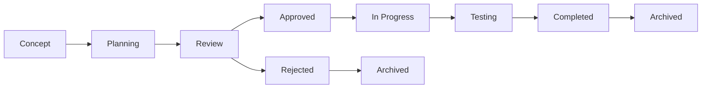

# Working with Plans

Plans in Magic Vibe are comprehensive Product Requirements Documents (PRDs) that define project features and guide development workflows.

## What are Plans?

Plans are structured documents that:

- Define feature requirements and specifications
- Provide context for AI-assisted development
- Break down complex features into manageable components
- Track progress from conception to completion

## Plan Structure

Every Magic Vibe plan follows a standardized 8-section structure:

### 1. Overview & Objectives

- Feature purpose and business value
- Success criteria and metrics
- Target users and use cases

### 2. Requirements Specification

- Functional requirements
- Non-functional requirements
- Technical constraints
- Dependencies and integrations

### 3. Technical Architecture

- System design and components
- Data models and schemas
- API specifications
- Technology stack decisions

### 4. Implementation Strategy

- Development phases and milestones
- Task breakdown and sequencing
- Resource allocation
- Risk assessment and mitigation

### 5. Quality Assurance

- Testing strategy and coverage
- Performance requirements
- Security considerations
- Compliance requirements

### 6. Deployment & Operations

- Deployment strategy
- Monitoring and alerting
- Rollback procedures
- Maintenance requirements

### 7. Timeline & Milestones

- Project phases and deadlines
- Critical path identification
- Dependencies and blockers
- Progress tracking metrics

### 8. Success Metrics

- Key Performance Indicators (KPIs)
- Business metrics
- Technical metrics
- User satisfaction measures

## Creating Plans

### Using AI Assistance

Create a new plan with AI help:

```text
@.magic-vibe/rules/core/plans.md create a plan for user authentication system
```

The AI will generate a comprehensive PRD following the standard structure.

### Manual Plan Creation

1. Create a new file in `.magic-vibe/ai/plans/`
2. Use the naming convention: `YYYY-MM-DD-feature-name.md`
3. Follow the 8-section template structure
4. Update the plan index in `PLANS.md`

### Plan Templates

Common plan templates are available for:

- **Feature Development**: New application features
- **System Integration**: Third-party service integration
- **Performance Optimization**: System performance improvements
- **Security Enhancement**: Security feature implementation
- **Infrastructure Setup**: DevOps and infrastructure changes

## Plan Management

### Plan Lifecycle



### Status Tracking

Plans can have the following statuses:

- **Draft**: Initial planning phase
- **Review**: Under stakeholder review
- **Approved**: Ready for implementation
- **In Progress**: Active development
- **Testing**: Under quality assurance
- **Completed**: Successfully implemented
- **On Hold**: Temporarily paused
- **Cancelled**: Discontinued

### Plan Updates

Update existing plans:

```text
@.magic-vibe/rules/core/plans.md update the authentication plan with OAuth integration
```

All changes are tracked in the plan file and git history.

## Working with Plan Hierarchies

### Parent-Child Relationships

Large features can be broken into sub-plans:

```text
authentication-system.md           # Parent plan
├── oauth-integration.md           # Child plan
├── user-registration.md           # Child plan
└── password-reset.md              # Child plan
```

### Plan Dependencies

Define dependencies between plans:

- **Prerequisite Plans**: Must be completed before this plan starts
- **Parallel Plans**: Can be developed simultaneously
- **Dependent Plans**: Cannot start until this plan completes

## Plan-to-Task Generation

### Automatic Task Generation

Generate tasks from approved plans:

```text
@.magic-vibe/rules/core/tasks.md generate tasks from the authentication plan
```

This creates:

- Individual task files in `.magic-vibe/ai/tasks/`
- Task entries in `TASKS.md`
- Proper task dependencies and sequencing

### Manual Task Creation

Break down plans manually:

1. Identify discrete work items
2. Create task files with clear deliverables
3. Establish task dependencies
4. Assign priorities and estimates

## Best Practices

### Plan Writing Guidelines

1. **Be Specific**: Clear, measurable requirements
2. **Think Holistically**: Consider all system impacts
3. **Plan for Testing**: Include QA and validation strategies
4. **Consider Operations**: Deployment and maintenance needs
5. **Document Decisions**: Record architectural and design choices

### Collaboration Strategies

- **Stakeholder Review**: Include business and technical stakeholders
- **Iterative Refinement**: Regularly update plans based on feedback
- **Cross-Team Input**: Involve security, DevOps, and other teams
- **Risk Assessment**: Identify and plan for potential issues

### Plan Maintenance

- **Regular Reviews**: Periodic plan assessment and updates
- **Progress Tracking**: Monitor implementation against plan
- **Lessons Learned**: Document insights for future plans
- **Archive Completed**: Move finished plans to memory

## Integration with Development Workflow

### Git Integration

- Plans stored in version control for full history
- Branch creation tied to plan implementation
- Commit messages reference plan IDs
- Pull requests link to relevant plans

### CI/CD Integration

- Automated plan validation
- Deployment gates based on plan completion
- Quality checks against plan requirements
- Automated progress updates

### Team Coordination

- Shared plan visibility across team members
- Standardized plan format for consistency
- Clear ownership and responsibility assignment
- Regular plan review meetings

## Advanced Plan Features

### Reusable Plan Templates

Create reusable plan templates:

```text
@.magic-vibe/rules/core/plans.md create a template for API development plans
```

### Plan Analytics

Track plan metrics:

- Time from planning to completion
- Requirement change frequency
- Success rate and quality metrics
- Resource utilization patterns

### Plan Automation

Automate plan-related tasks:

- Automatic status updates based on task completion
- Progress notifications and alerts
- Integration with project management tools
- Automated reporting and dashboards

## Example Plan Structure

Here's a sample plan structure for reference:

```markdown
# User Authentication System Plan

**Plan ID**: AUTH-2025-001
**Created**: 2025-09-04
**Status**: Draft
**Owner**: Development Team

## 1. Overview & Objectives

### Purpose
Implement a secure, scalable user authentication system to enable user registration, login, and session management.

### Success Criteria
- 99.9% authentication uptime
- Sub-200ms authentication response time
- Support for 10,000 concurrent users
- GDPR and SOC2 compliance

### Target Users
- End users requiring account access
- Administrators managing user accounts
- Third-party integrations via API

## 2. Requirements Specification

### Functional Requirements
- User registration with email verification
- Secure login with password and 2FA
- Password reset functionality
- Session management and logout
- Role-based access control (RBAC)

### Non-Functional Requirements
- 99.9% availability SLA
- Sub-200ms response time for auth operations
- Support for 10,000 concurrent sessions
- GDPR compliance for user data
- SOC2 Type II compliance

### Technical Constraints
- Must integrate with existing user database
- Compatible with React frontend
- RESTful API design
- JWT token-based authentication

## 3. Technical Architecture

### System Components
- Authentication Service (FastAPI)
- User Database (PostgreSQL)
- Session Store (Redis)
- Email Service (SendGrid)
- Frontend Integration (React)

### API Specifications

    POST /auth/register
    POST /auth/login
    POST /auth/logout
    POST /auth/refresh
    POST /auth/forgot-password
    POST /auth/reset-password

## 4. Implementation Strategy

### Phase 1: Core Authentication (Week 1-2)

- Basic login/logout functionality
- JWT token generation and validation
- User registration with email verification

### Phase 2: Enhanced Security (Week 3)

- Two-factor authentication (2FA)
- Password policies and validation
- Rate limiting and brute force protection

### Phase 3: Administration (Week 4)

- User management interface
- Role-based access control
- Audit logging and monitoring

## 5. Quality Assurance

### Testing Strategy

- Unit tests for all authentication functions (90% coverage)
- Integration tests for API endpoints
- Security penetration testing
- Load testing for 10,000 concurrent users

### Security Requirements

- Password hashing with bcrypt
- Secure JWT token handling
- HTTPS-only communication
- Input validation and sanitization

## 6. Deployment & Operations

### Deployment Strategy

- Blue-green deployment for zero downtime
- Database migration scripts
- Environment configuration management
- Rollback procedures for failed deployments

### Monitoring

- Authentication success/failure rates
- Response time monitoring
- Error rate alerting
- Security event logging

## 7. Timeline & Milestones

### Week 1

- ✅ Database schema design
- ✅ Core authentication API development
- 🔄 Basic frontend integration

### Week 2

- 📅 Email verification system
- 📅 Password reset functionality
- 📅 Initial testing and validation

### Week 3

- 📅 2FA implementation
- 📅 Security hardening
- 📅 Performance optimization

### Week 4

- 📅 Admin interface development
- 📅 Final testing and documentation
- 📅 Production deployment

## 8. Success Metrics

### Business Metrics

- User registration conversion rate > 85%
- Authentication failure rate < 1%
- User satisfaction score > 4.5/5

### Technical Metrics

- 99.9% uptime achievement
- < 200ms average response time
- Zero security incidents
- 90%+ test coverage maintained

---

**Last Updated**: 2025-09-04
**Next Review**: 2025-09-11
```

---

Plans are the foundation of successful Magic Vibe projects. They provide structure, clarity, and guidance for both human developers and AI assistants throughout the development lifecycle.
