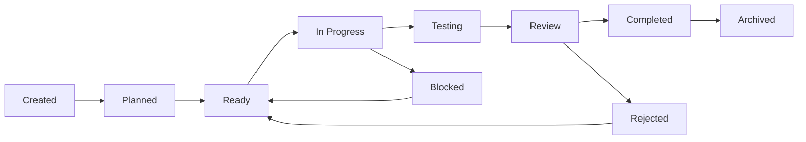

# Task Workflows

Tasks are the atomic units of work in Magic Vibe, representing specific, actionable items that contribute to plan completion.

## Understanding Tasks

### What are Tasks?

Tasks in Magic Vibe are:

- **Specific Work Items**: Discrete, well-defined pieces of work
- **Measurable Deliverables**: Clear success criteria and outputs
- **Time-Bounded**: Realistic estimates and deadlines
- **Dependency-Aware**: Understanding of prerequisites and blockers
- **Trackable**: Status updates and progress monitoring

### Task Characteristics

Each task should be:

- **Actionable**: Clear what needs to be done
- **Achievable**: Realistic scope and complexity
- **Assignable**: Can be owned by a person or AI agent
- **Assessable**: Success can be objectively measured
- **Atomic**: Cannot be meaningfully broken down further

## Task Structure

### Standard Task Format

Every task follows a consistent structure:

```markdown
# Task: [Task Title]

**Task ID**: TASK-YYYY-MM-DD-XXX
**Plan**: [Related Plan ID]
**Status**: [Status]
**Priority**: [High/Medium/Low]
**Estimate**: [Time Estimate]
**Assignee**: [Person/AI Agent]
**Created**: [Date]
**Due**: [Date]

## Description

[Clear description of what needs to be accomplished]

## Acceptance Criteria

- [ ] Criterion 1
- [ ] Criterion 2
- [ ] Criterion 3

## Dependencies

### Prerequisites
- [List of tasks that must be completed first]

### Blocked By
- [List of current blockers]

### Blocks
- [List of tasks waiting for this completion]

## Implementation Notes

[Technical details, approach, considerations]

## Testing Requirements

[How to validate completion]

## Progress Log

- [Date]: [Progress update]

## Completion

**Completed**: [Date]
**Validated By**: [Person/AI]
**Notes**: [Completion notes]
```

### Task Types

Magic Vibe supports different task types:

1. **Development Tasks**: Code implementation
2. **Design Tasks**: UI/UX design work
3. **Testing Tasks**: Quality assurance and validation
4. **Documentation Tasks**: Writing and updating docs
5. **Infrastructure Tasks**: DevOps and system setup
6. **Research Tasks**: Investigation and analysis
7. **Review Tasks**: Code and design reviews

## Task Lifecycle

### Task States



### State Definitions

- **Created**: Task has been defined but not yet planned
- **Planned**: Task has been scheduled and estimated
- **Ready**: All prerequisites met, ready to start
- **In Progress**: Active work is happening
- **Testing**: Implementation complete, under validation
- **Review**: Under peer or stakeholder review
- **Blocked**: Cannot proceed due to external dependencies
- **Rejected**: Needs rework or reconsideration
- **Completed**: Successfully finished and validated
- **Archived**: Moved to memory for historical reference

## Creating Tasks

### From Plans

Generate tasks automatically from plans:

```text
@.magic-vibe/rules/core/tasks.md generate tasks from the authentication plan
```

This creates a comprehensive task breakdown with:

- Logical task sequencing
- Proper dependency mapping
- Realistic estimates
- Clear acceptance criteria

### Manual Task Creation

Create tasks manually:

1. **Create Task File**

   ```bash
   # File: .magic-vibe/ai/tasks/YYYY-MM-DD-task-name.md
   ```

2. **Add to Task Index**

   ```markdown
   # In TASKS.md
   - [TASK-001] User Registration API (In Progress)
   ```

3. **Set Up Dependencies**

   ```markdown
   ### Prerequisites
   - TASK-002: Database Schema Setup
   ```

### AI-Assisted Task Creation

Let AI help create specific tasks:

```text
@.magic-vibe/rules/core/tasks.md create a task for implementing JWT authentication
```

## Task Management

### Priority Management

Tasks are prioritized using:

1. **High Priority**: Critical path items, blockers
2. **Medium Priority**: Important but not blocking
3. **Low Priority**: Nice-to-have, future improvements

### Estimation Guidelines

Use consistent estimation:

- **XS**: 1-2 hours (bug fixes, minor updates)
- **S**: 0.5-1 day (small features, simple tasks)
- **M**: 1-3 days (medium features, moderate complexity)
- **L**: 3-5 days (large features, complex implementation)
- **XL**: 1+ weeks (major features, requires breakdown)

### Dependency Management

Track dependencies carefully:

```markdown
### Dependencies
**Prerequisites**: 
- TASK-001: Authentication API (Completed)
- TASK-002: User Database (In Progress)

**Blocked By**:
- External API approval pending

**Blocks**:
- TASK-005: User Profile Management
- TASK-006: Password Reset Feature
```

## Working with Tasks

### Starting a Task

When beginning work:

```text
@.magic-vibe/rules/core/tasks.md start working on JWT authentication task
```

This automatically:

- Updates task status to "In Progress"
- Logs start time
- Applies relevant development rules
- Sets up workspace context

### Updating Progress

Regular progress updates:

```text
Update task TASK-2025-001 with progress on API endpoint implementation
```

Or manually update the task file:

```markdown
## Progress Log

- 2025-09-04: Started API endpoint development
- 2025-09-05: Completed JWT token generation logic
- 2025-09-06: Added token validation middleware
```

### Completing Tasks

Mark tasks complete:

```text
@.magic-vibe/rules/core/tasks.md mark JWT authentication task as completed
```

This triggers:

- Status update to "Completed"
- Validation checklist
- Automatic notification of dependent tasks
- Archive to memory if fully validated

## Task Collaboration

### Team Coordination

For team environments:

1. **Clear Ownership**

   ```markdown
   **Assignee**: John Doe
   **Reviewer**: Jane Smith
   ```

2. **Status Communication**
   - Regular standup updates
   - Progress log entries
   - Blocker notifications

3. **Handoff Procedures**

   ```markdown
   ## Handoff Notes
   - API endpoints implemented and tested
   - Documentation updated
   - Ready for frontend integration
   ```

### AI-Human Collaboration

Tasks can be:

- **AI-Led**: AI implements with human review
- **Human-Led**: Human implements with AI assistance  
- **Collaborative**: Joint implementation

Example AI-led task:

```text
@.magic-vibe/rules/core/tasks.md AI should implement the user registration API according to the task specification
```

## Advanced Task Features

### Task Templates

Create reusable task templates:

```text
@.magic-vibe/rules/core/tasks.md create a template for API endpoint development tasks
```

### Automated Task Updates

Set up automation:

```markdown
# In .magic-vibe/ai/hooks/task_automation.md

## Git Integration
- Automatically update task status based on commits
- Link commits to task IDs
- Update progress based on branch merges

## CI/CD Integration  
- Mark tasks complete when tests pass
- Update status on deployment success
- Notify on integration failures
```

### Task Analytics

Track task metrics:

```text
Show me analytics for completed tasks in the authentication plan
```

This provides:

- Average completion time by task type
- Estimation accuracy
- Blocker frequency and resolution time
- Quality metrics (rework rate, defect count)

## Task Organization

### Categorization

Organize tasks by:

1. **Feature Area**: Authentication, User Management, API
2. **Technical Layer**: Frontend, Backend, Database
3. **Team**: Development, QA, DevOps
4. **Sprint/Milestone**: Sprint 1, MVP, Beta Release

### Filtering and Views

Common task views:

```text
# Active tasks for current user
Show me my current tasks

# Blocked tasks needing attention  
Show me all blocked tasks

# High priority items
Show me high priority tasks

# Tasks ready to start
Show me ready tasks for the authentication feature
```

## Best Practices

### Task Definition

1. **Clear Scope**: Well-defined boundaries
2. **Acceptance Criteria**: Specific, testable conditions
3. **Realistic Estimates**: Based on historical data
4. **Proper Dependencies**: Accurate prerequisite mapping

### Task Execution

1. **Regular Updates**: Keep progress current
2. **Early Communication**: Flag blockers immediately
3. **Quality Focus**: Meet acceptance criteria fully
4. **Documentation**: Maintain implementation notes

### Task Completion

1. **Validation**: Verify all acceptance criteria
2. **Testing**: Ensure quality standards
3. **Documentation**: Update relevant docs
4. **Handoff**: Clear completion communication

---

Effective task management is crucial for Magic Vibe success. Tasks provide the granular tracking needed to ensure plans are executed successfully while maintaining quality and predictability.
