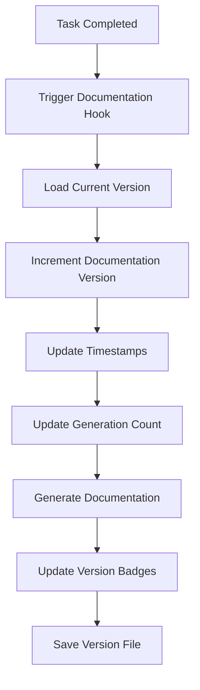

# Automatic Versioning System

The Magic Vibe system includes a comprehensive automatic versioning system that tracks both project and documentation versions with complete history and metadata.

## Overview

The versioning system automatically manages:

- **Project Version**: Main project release version (semantic versioning)
- **Documentation Version**: Auto-incremented on each task completion  
- **Build Numbers**: Incremental build tracking
- **Generation Counters**: Number of documentation generations
- **Timestamps**: Complete audit trail of changes
- **System Compatibility**: Magic Vibe system version tracking

## Version Configuration

### Version File Structure

The main version configuration is stored in `.magic-vibe/ai/version.json`:

```json
{
  "project": {
    "version": "0.1.0",
    "name": "magic-vibe",
    "build": "1",
    "release_date": "2025-01-15",
    "changelog_url": "https://github.com/teratron/magic-vibe/releases"
  },
  "documentation": {
    "version": "0.1.0",
    "format_version": "2.0",
    "last_updated": "2025-01-15T10:00:00Z",
    "last_auto_generation": "2025-01-15T10:00:00Z",
    "generation_count": 1,
    "languages": ["en", "ru"],
    "primary_language": "en"
  },
  "task_magic": {
    "system_version": "0.2.1",
    "compatibility": "^0.2.0",
    "last_hook_execution": null,
    "documentation_hooks_version": "0.1.1"
  }
}
```

### Version Fields Explained

#### Project Section

- **version**: Semantic version (MAJOR.MINOR.PATCH)
- **name**: Project identifier
- **build**: Incremental build number
- **release_date**: Last release date (YYYY-MM-DD)
- **changelog_url**: Link to release notes

#### Documentation Section  

- **version**: Documentation version (auto-incremented)
- **format_version**: Documentation format specification
- **last_updated**: ISO timestamp of last update
- **last_auto_generation**: Timestamp of last automatic generation
- **generation_count**: Total number of documentation generations
- **languages**: Supported documentation languages
- **primary_language**: Primary documentation language

#### Magic Vibe Section

- **system_version**: Magic Vibe system version
- **compatibility**: Compatible version range
- **last_hook_execution**: Timestamp of last hook execution
- **documentation_hooks_version**: Documentation hooks version

## Automatic Version Management

### Documentation Version Auto-Increment

Every time a task is completed, the documentation version is automatically incremented:

1. **Task Completion Trigger**: When a task status changes to `completed`
2. **Version Increment**: Documentation version patch number increases
3. **Metadata Update**: Timestamps and generation count updated
4. **Badge Updates**: Version badges in README files updated

### Version Update Flow



## Manual Version Management

### Version Manager Script

Use the version manager script for manual version control:

```bash
# Show current versions
./.magic-vibe/tools/version-manager.sh show

# Bump project version
./.magic-vibe/tools/version-manager.sh bump-project minor

# Set specific project version
./.magic-vibe/tools/version-manager.sh set-project 2.0.0

# Bump documentation version
./.magic-vibe/tools/version-manager.sh bump-docs patch

# Set specific documentation version
./.magic-vibe/tools/version-manager.sh set-docs 1.5.0
```

### Version Commands

| Command                 | Description                     | Example                                   |
|-------------------------|---------------------------------|-------------------------------------------|
| `show`                  | Display current versions        | `./version-manager.sh show`               |
| `bump-project [type]`   | Increment project version       | `./version-manager.sh bump-project major` |
| `bump-docs [type]`      | Increment documentation version | `./version-manager.sh bump-docs minor`    |
| `set-project <version>` | Set specific project version    | `./version-manager.sh set-project 3.1.0`  |
| `set-docs <version>`    | Set specific docs version       | `./version-manager.sh set-docs 2.0.0`     |
| `auto-docs`             | Auto-increment docs (for hooks) | `./version-manager.sh auto-docs`          |

### Version Types

- **major**: Breaking changes (1.0.0 → 2.0.0)
- **minor**: New features (1.0.0 → 1.1.0)  
- **patch**: Bug fixes (1.0.0 → 1.0.1)

## Version Display

### README Badges

Version information is displayed via badges in README files:

```markdown
[](https://github.com/teratron/magic-vibe/releases)
[](../)
[](../.magic-vibe/)
```

### Documentation Headers

Each generated documentation file includes version information:

```markdown
## Version Information

**Project Version:** 1.0.0  
**Documentation Version:** 1.0.1  
**Magic Vibe System:** v2.1.0  
**Generation #:** 5
```

### Documentation Footers

All documentation includes version footers:

```markdown
*Documentation Version: v1.0.1 | Project Version: v1.0.0*  
*Last Updated: 2024-01-15 14:30:00 UTC | Generation Count: 5*  
*Format Version: v2.0 | Primary Language: English*
```

## Hook Integration

### Automatic Hooks

The versioning system integrates with the following hooks:

1. **comprehensive-docs.hook.md**: Full documentation generation with versioning
2. **generate-docs.hook.md**: Basic documentation generation with versioning  
3. **version-management.hook.md**: Version tracking and badge updates

### Hook Execution Order

1. **Priority 5**: Version management hook
2. **Priority 20**: Basic documentation generation
3. **Priority 25**: Comprehensive documentation generation

### Version Variables in Hooks

Hooks can access version information via these variables:

```bash
project_version=$(get_version "project" "version")
doc_version=$(get_version "documentation" "version")
task_magic_version=$(get_version "task_magic" "system_version")
generation_count=$(get_version "documentation" "generation_count")
```

## Version History Tracking

### Documentation Index Updates

Each task completion adds version tracking to documentation indexes:

```markdown
### Task 42: Implement User Authentication

**Completed:** 2024-01-15 14:30:00 UTC  
**Feature:** User Management  
**Type:** feat  
**Documentation Version:** 1.0.5  

[View Documentation](.magic-vibe/ai/tasks/task_42_user_management.md)
```

### Version History Logs

The system maintains version history in documentation:

```markdown
### Version History

- **v1.0.5** (2024-01-15): Added user authentication system
- **v1.0.4** (2024-01-14): Implemented task management
- **v1.0.3** (2024-01-13): Initial project setup
```

## Best Practices

### Project Versioning

1. **Use Semantic Versioning**: Follow MAJOR.MINOR.PATCH format
2. **Document Changes**: Update changelog for each release
3. **Tag Releases**: Use Git tags for version releases
4. **Backward Compatibility**: Consider API/feature compatibility

### Documentation Versioning

1. **Automatic Increment**: Let the system handle documentation versions
2. **Manual Override**: Use manual versioning for major documentation updates
3. **Language Sync**: Keep all language versions synchronized
4. **History Preservation**: Maintain version history in documentation

### Version Coordination

1. **Project Releases**: Align project and documentation major versions
2. **Feature Completion**: Document version increments track feature progress
3. **Audit Trail**: Maintain complete version history and timestamps
4. **System Compatibility**: Ensure Magic Vibe version compatibility

## Troubleshooting

### Common Issues

1. **Version File Missing**: System will display "unknown" versions
2. **Permission Errors**: Ensure write access to version.json
3. **Python Dependency**: Requires Python 3 for JSON processing
4. **Badge Updates**: May require manual refresh of README files

### Recovery Procedures

1. **Recreate Version File**: Use version-manager.sh to initialize
2. **Reset Versions**: Set specific versions to recover from errors
3. **Manual Badge Update**: Edit README files manually if automated updates fail
4. **Backup Restoration**: Restore from Git history if needed

## Advanced Features

### Custom Version Formats

The system supports custom version formatting:

```json
{
  "documentation": {
    "format_version": "2.0",
    "version_pattern": "MAJOR.MINOR.PATCH",
    "increment_strategy": "patch_per_task"
  }
}
```

### Multi-Language Coordination

Version information is maintained across all supported languages:

- **Primary Language**: English (en)
- **Secondary Language**: Russian (ru)
- **Synchronized Updates**: All languages updated simultaneously
- **Localized Formats**: Date/time formats adapted per language

### Integration Points

The versioning system integrates with:

- **Git Hooks**: Pre-commit and post-commit version updates
- **CI/CD Pipelines**: Automated version bumping
- **Release Management**: Changelog generation
- **Documentation Sites**: Static site generator integration

---

*This versioning system provides complete automation and tracking for both project and documentation versions, ensuring consistent and reliable version management throughout the development lifecycle.*
