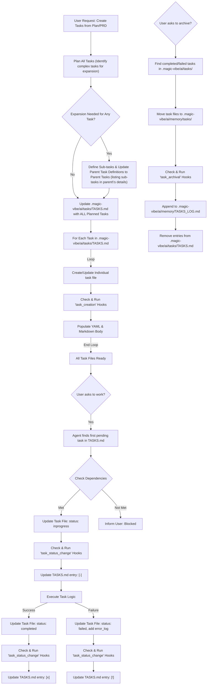

# Magic Vibe Workflow Diagram

Below is the workflow diagram for the Magic Vibe system, illustrating the process of task creation, execution, and archival.

```mermaid
graph TD
  A[User Request: Create Tasks from Plan/PRD] --> B["Plan All Tasks (Identify complex tasks for expansion)"];
  B --> B1{Expansion Needed for Any Task?};
  B1 -- Yes --> B2["Define Sub-tasks & Update Parent Task Definitions to Parent Tasks (listing sub-tasks in parent\'s details)"];
  B1 -- No --> C;
  B2 --> C["Update .magic-vibe/ai/tasks/TASKS.md with ALL Planned Tasks"];
  C --> D["For Each Task in .magic-vibe/ai/tasks/TASKS.md"];
  D -- Loop --> E["Create/Update Individual task file"];
  E --> E_HOOK["Check & Run 'task_creation' Hooks"];
  E_HOOK --> F["Populate YAML & Markdown Body"];
  F -- End Loop --> G[All Task Files Ready];
  G --> H{User asks to work?};
  H -- Yes --> I["Agent finds first pending task in TASKS.md"];
  I --> J{Check Dependencies};
  J -- Met --> K["Update Task File: status: inprogress"];
  K --> K_HOOK["Check & Run 'task_status_change' Hooks"];
  K_HOOK --> L["Update TASKS.md entry: [-]"];
  L --> M[Execute Task Logic];
  M -- Success --> N["Update Task File: status: completed"];
  N --> N_HOOK["Check & Run 'task_status_change' Hooks"];
  N_HOOK --> O["Update TASKS.md entry: [x]"];
  M -- Failure --> P["Update Task File: status: failed, add error_log"];
  P --> P_HOOK["Check & Run 'task_status_change' Hooks"];
  P_HOOK --> Q["Update TASKS.md entry: [!]"];
  J -- Not Met --> R[Inform User: Blocked];
  S{User asks to archive?} --> T["Find completed/failed tasks in .magic-vibe/ai/tasks/"];
  T --> U["Move task files to .magic-vibe/ai/memory/tasks/"];
  U --> U_HOOK["Check & Run 'task_archival' Hooks"];
  U_HOOK --> V["Append to .magic-vibe/ai/memory/TASKS_LOG.md"];
  V --> W["Remove entries from .magic-vibe/ai/tasks/TASKS.md"];
```
